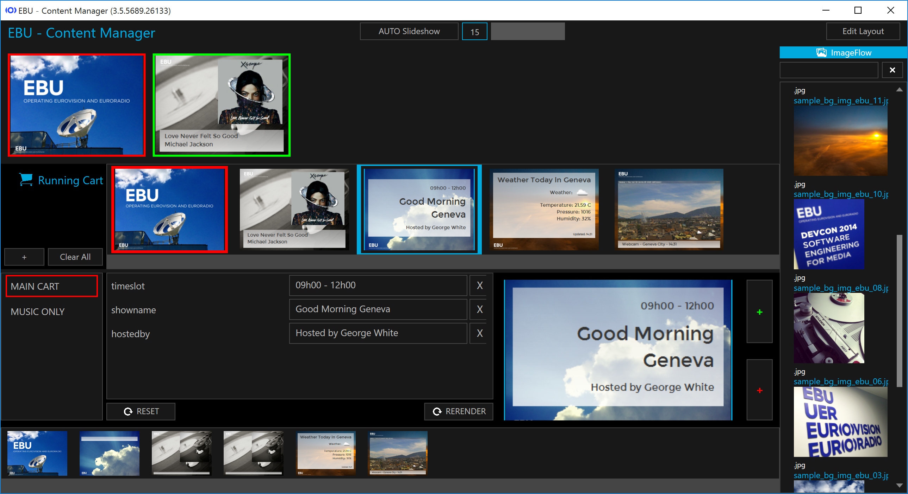

# EBU Content Manager

The Content Manager is a visual production tool which is able to generate on the fly 
visualisation for DAB slideshow and RadioVIS. 
.NET framework based, it is developped in C# and is distributed under LGPL licence.

The Content Manager can run in a standalone fashion or in an advanced DataGateway environment
allowing external data providers such as Swisstiming to provide valuable data to generate
slideshows for live sports events.

As example of images the Content Manager can generate and we it was used for at EBU see the following two event
reports of sport cases:

* [EURORADIO @ 2014 European Athletics Championships in Zürich](http://output.ebu.io/archive/zurich2014/)
* [EURORADIO @ 2015 FIS Alpine World Ski Championships in Vail / Beaver Creek](http://output.ebu.io/archive/vail2015/)

## Quick Start

You can download a ZIP file with the precompiled and demo configured Content Manager and start using it right away:

[https://github.com/ebu/content-manager/releases](https://github.com/ebu/content-manager/releases)

## Documentation

See the	doc folder for configuration, usage and api documentation

* [Documentation](doc)

----

## Prerequisites

In Order to build the project:

* Microsoft Visual Studio 2015, C# 6.0 
(or [community edition](https://www.visualstudio.com/en-us/products/visual-studio-community-vs.aspx))

### Dependencies

Beside the Nuget Package Manager dependencies which are resolved automatically by Visual Studio, the Content Manager
does not require any other depencies to be installed on the development machine.

#### Nuget Dependencies

The following third-party libraries use in the solutions:

* Apache.NMS
* Apache.NMS.Stomp
* RabbitMQ.Client
* AWSSDK
* PhantomJS

## Getting started (a bit slower than quick start)

Use git to clone the repository or add this repository as team source in your Visual Studio Environment.

    $ git clone https://github.com/ebu/content-manager.git

Set the `io.ebu.eis.contentmanager` as startup project and build the solutions.

Create a configuration file.

### Configure

The configuration documentation can be found in the 
[Content Manager Configuration](doc/Configuration.md) document.

----

## Related projects

* [EBU RadioDns PlugIt and VIS Server](https://github.com/ebu/radiodns-plugit)

## Contributors

* [Michael Barroco](https://github.com/barroco) (EBU)
* [Mathieu Habegger](https://github.com/mhabegger) (SMP)

## Copyright & license

Copyright (c) 2015, EBU-UER Technology & Innovation

The Content Manager and its libraries are distributed under LGPL licence (see LICENSE.txt).

Multiple external libraries are used and referenced using NuGet Package Manager.
According licenses are available on the repository sites. 
Other libraries not included using NuGet are listed explicitely below.

#### Licenses of third party components

##### Apache.NMS
License under Apache 2.0  
http://activemq.apache.org/nms/

##### AMQP.Client
.NET/C# AMQP client library and WCF binding  
The library is open-source, and is dual-licensed under the Apache License v2 and the Mozilla Public License v1.1.  
http://www.rabbitmq.com/dotnet.html

##### AWS SDK for .NET
Licensed under Apache 2.0  
https://github.com/aws/aws-sdk-net/blob/master/License.txt

##### PhantomJS
PhantomJS Nuget Packaget https://www.nuget.org/packages/PhantomJS/,   
Licensed under BSD  
http://phantomjs.org, https://github.com/ariya/phantomjs/blob/master/LICENSE.BSD

